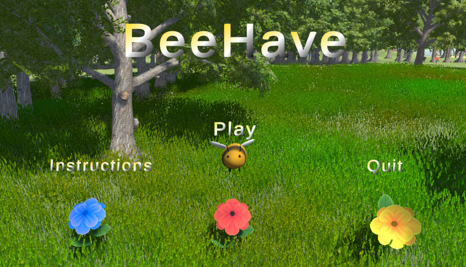
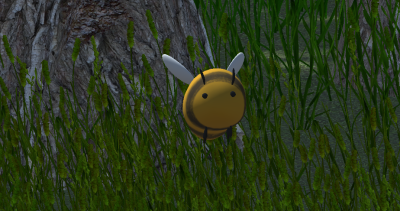
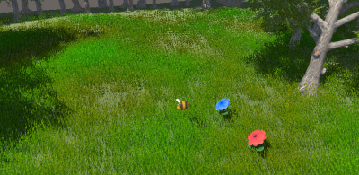
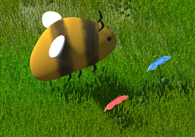
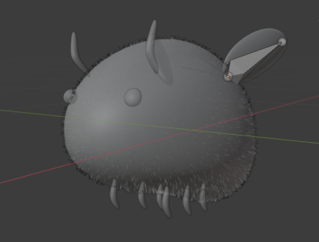
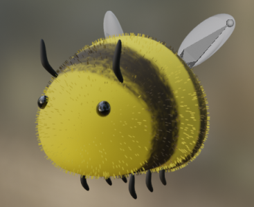

Have you ever dreamt of being as annoying as possible and ruining people's days? BeeHave is an open-world adventure game where the user plays as a Bee, pollinates flowers to collect different power-ups, or as we like to call them "flower-ups", to annoy humans.

## Team Members
- Micah Kim
- Jiajun Kang
- James Lau

## Game Engine

The game is created entirely in Unity and Blender, and the user will use the WASD keys to control the bee. 

In-Game:

The bee (you) was created from scratch in Blender. The game have three unique animations for the Bee, flying, pollinating, and stinging. The terrain and the human are assets downloaded from the assets store, but the animation for the human is entirely unique. The human asset was downloaded, then imported into blender to bring to life. The animations featured for the human asset includes idle, slapping, stung, walking, swatting, fainitng, and getting scared. 

## Current Game State
- Character movement finished
- Character model completed
- Landscape completed
- Basic funtionality of flower-ups created

## View Miro <a href="https://miro.com/app/board/o9J_lSn7fj4=/">Here</a> 

## View Trello Board <a href="https://trello.com/b/Qbd5DfBi/bee-simulator">Here</a>

